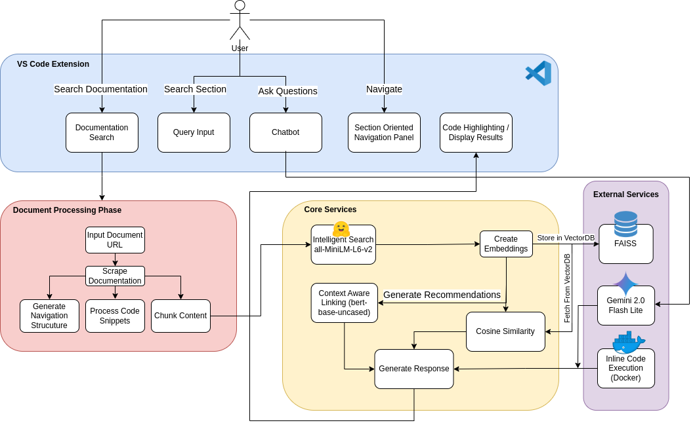

# DocHelp - VSCode Extension for Enhanced Product Documentation

## 🚀 Overview

This project aims to enhance the readability, searchability, and overall user experience of product documentation using a VSCode extension. By integrating intelligent search, contextual recommendations, and navigation improvements, we help developers find relevant information faster and boost productivity.

## 🧾 Problem Statement

Developers often face difficulties navigating and understanding product documentation due to:

- Outdated or incomplete documentation.
- Inefficient search mechanisms.
- Lack of contextual help and relevant examples.
- Time-consuming knowledge retrieval processes.

## ✅ Our Solution

This VSCode extension leverages AI-driven search and contextual recommendations to improve documentation accessibility. Key features include:

- **Intelligent Search:** Uses **all-MiniLM-L6-v2** for semantic search, ensuring relevant results.
- **Context-Aware Linking:** Uses **bert-base-uncased** to provide interlinked references within documentation.
- **Chatbot Support:** AI chatbot powered by **Gemini Flash 2.0 Lite**  to assist developers with queries.
- **Forums Support:** Quick access to relevant forums across the internet.

## 🏗️ Architecture

### Components:

 - VSCode Extension UI
 - Document Processing Phase
 - Core Services
 - External Services



<br />

## 🛠️ Installation & Setup

### Prerequisites

- Node.js & npm
- VSCode
- Python (for AI models, FAISS DB and Flask setup)

### Steps to Install

#### 1️⃣ Setting up the VSCode Extension

1. Clone the repository:
   ```bash
   git clone https://github.com/ParasY1724/DocHelp.git
   cd DocHelp/code-extension
   ```
2. Install dependencies:
   ```bash
   npm install
   ```
3. Compile the extension:
   ```bash
   npm run compile
   ```
4. Open `extension.ts` file in VSCode, press `F5` to run in debug mode.
5. Press `F1`, select "Load Documentation", and paste the documentation URL.

#### 2️⃣ Setting up the Server

1. Navigate to the server directory:
   ```bash
   cd ../server
   ```
2. Create a virtual environment:
   ```bash
   python3 -m venv venv
   source venv/bin/activate  # On Windows use `venv\Scripts\activate`
   ```
3. Install dependencies:
   ```bash
   pip install -r requirements.txt
   ```
4. Run the Flask server:
   ```bash
   python3 app.py
   ```

### 🔑 Replacing API Keys

Before running the application, update the required API keys in the configuration files


## 👥 Authors
- **Paras Yerunkar**
- **Piyush Dahake**
- **Pratik Patil**
- **Tanay Duddalwar**

---

🔍 *Enhancing product documentation, one query at a time!* 🚀

